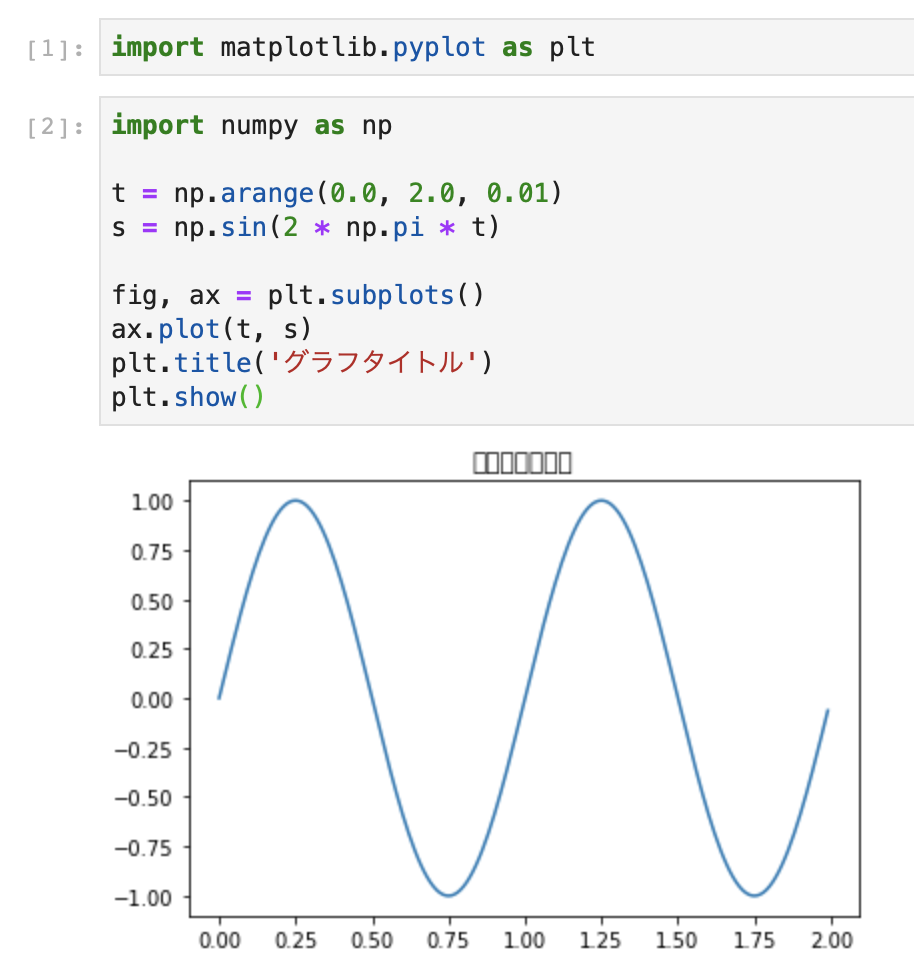
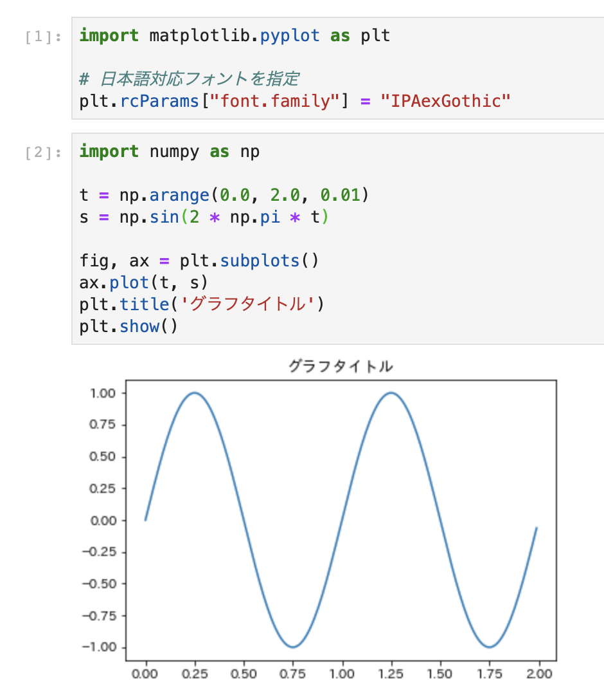
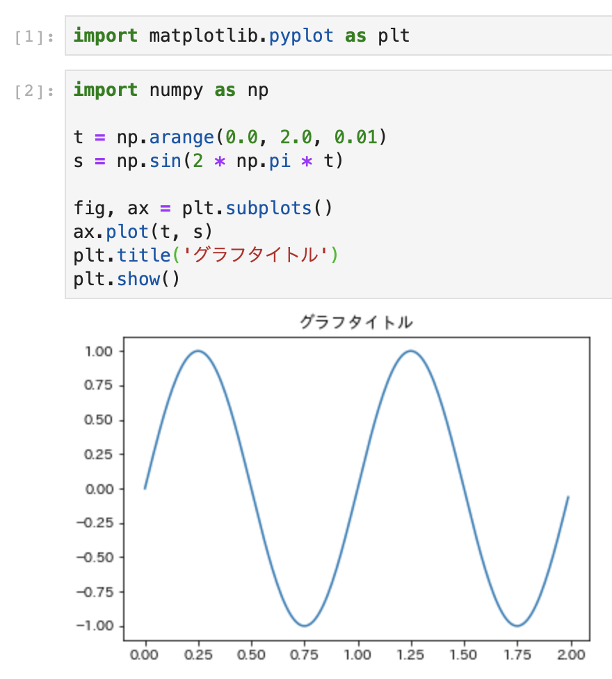

# Matplotlibで日本語を表示する

## はじめに
本書で紹介しているPython用グラフ描画ライブラリである`Matplotlib`は、デフォルトでは日本語を表示できません。
例えば、以下のようにグラフのタイトルに日本語を表示しようとすると、日本語部分が白い四角で表示されてしまいます。
これは、Matplotlibの既定フォントが日本語に対応していないことが原因です。

```python
import matplotlib.pyplot as plt
import numpy as np

t = np.arange(0.0, 2.0, 0.01)
s = np.sin(2 * np.pi * t)

fig, ax = plt.subplots()
ax.plot(t, s)
plt.title('グラフタイトル')
plt.show()
```



ここでは、Matplotlibで日本語を表示する方法を紹介します。

まず、日本語対応フォントをインストールします。
その後、Matplotlibで日本語対応フォントを使う方法として、
- 実行時に設定する方法
- Matplotlibの設定ファイルを変更する方法
の２つを紹介します。

## 日本語対応フォントをインストール

日本語対応フォントをさまざまな種類が存在しますが、ここでは **IPAexフォント** を使用します。
もちろん、使用しているOSに付属しているフォントや、お気に入りのフォントがある場合はそちらを使用して構いません。

IPAexフォントの圧縮ファイルは、以下のURLからダウンロードできます。

IPAexフォント

https://ipafont.ipa.go.jp/node26

「IPAex明朝」と「IPAexゴシック」の２種類が用意されており、どちらを使っても構いません。
以下では、「IPAexゴシック」を使用した例を紹介します。

圧縮ファイルをダウンロードしたら、インストールします。
OS別のインストール方法もIPA公式ページに記載されているので、お使いのOSに合わせてインストールしてください。

インストール方法

https://ipafont.ipa.go.jp/node72

## 実行時に設定する方法

Pythonコードの中で、さきほどインストールしたフォントを指定することで、日本語を表示できます。
以下のように、フォントの名前を指定してグラフを表示しましょう。

```python
import matplotlib.pyplot as plt

# IPAexゴシックを指定
plt.rcParams["font.family"] = "IPAexGothic" # IPAex明朝の場合は、「IPAexMincho」を指定する
```



無事に日本語が表示できました。

## Matplotlibの設定ファイルを変更する方法

実行時に設定する方法はお手軽に日本語を表示できますが、実行するスクリプトやNotebookの全てでフォントを指定しなければならないため、
少し手間がかかります。
ここでは、Matplotlibの設定ファイルを変更し、既定フォントをIPAexフォントにする方法を紹介します。

まず、Matplotlibの設定ファイルがどこに存在するか確認するため、以下のPythonスクリプトを実行します。

```python
import matplotlib
matplotlib.matplotlib_fname()
# /Users/ksmzn/.local/share/virtualenvs/pythonbook-j62U9zQq/lib/python3.7/site-packages/matplotlib/mpl-data/matplotlibrc'
```

この `matplotlibrc` が、Matplotlibの設定ファイルです。
表示されたMatplotlibをテキストエディタで開くと、Matplotlibの設定が記述されており、ほとんどの設定が「#」でコメントアウトされています。
「font.family」でファイル内を検索してフォントの設定をしている場所を探し、以下のように記載してください。

```
font.family : IPAexGothic
```

これでフォントの指定ができました。
Jupyterで実行している場合はJupyterを再起動し、日本語を用いたグラフを表示してみましょう。



スクリプト内でフォントを指定しなくとも、日本語を表示することができました。

## フォント指定が反映されない時は

上記のようにフォントを指定しても、Matplotlibで日本語が表示できない場合があります。
その際は、Matplotlibのキャッシュが残っている可能性があります。
以下のコードを実行し、キャッシュを再設定してみましょう。

```python
import matplotlib
matplotlib.font_manager._rebuild()
```
